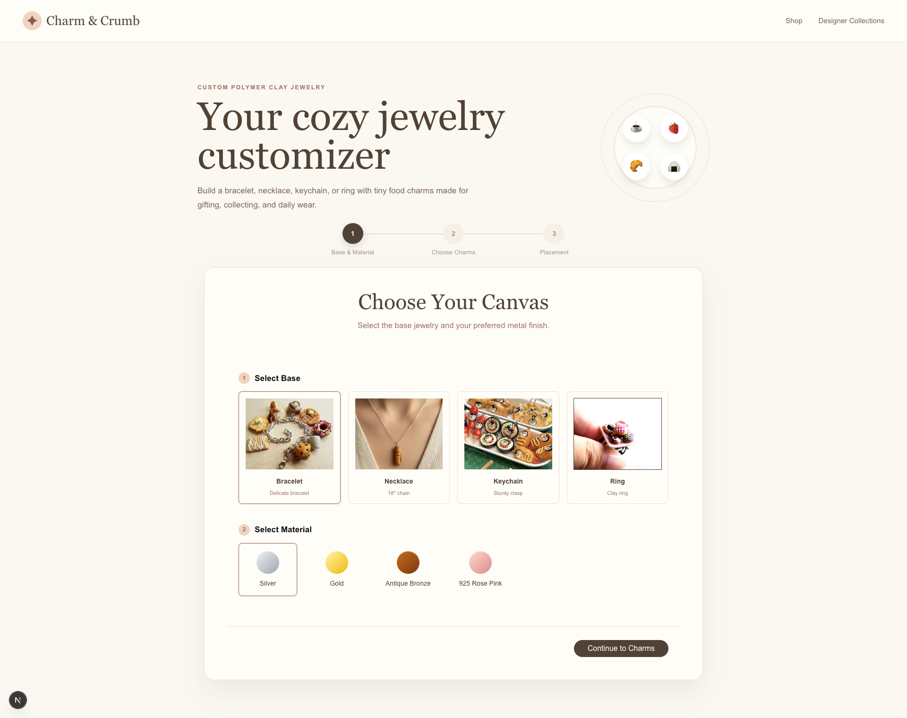
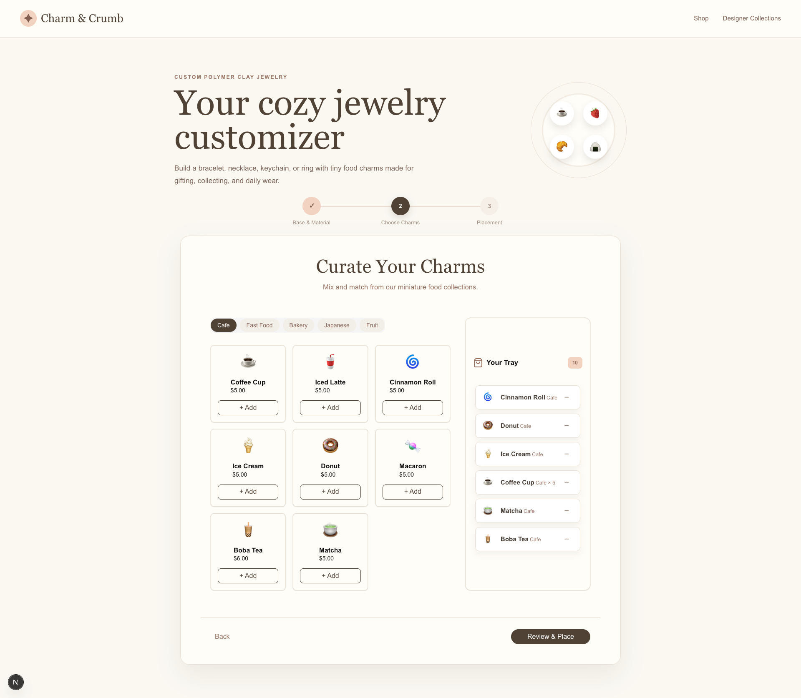
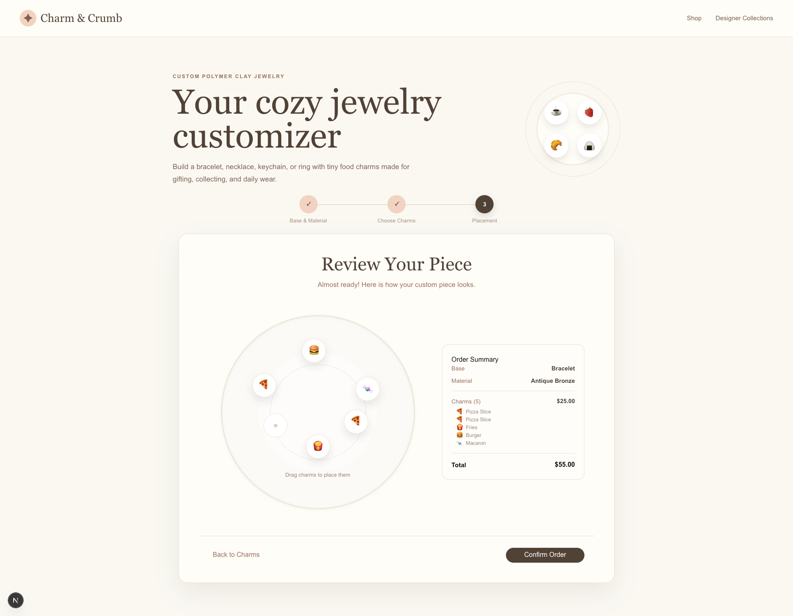
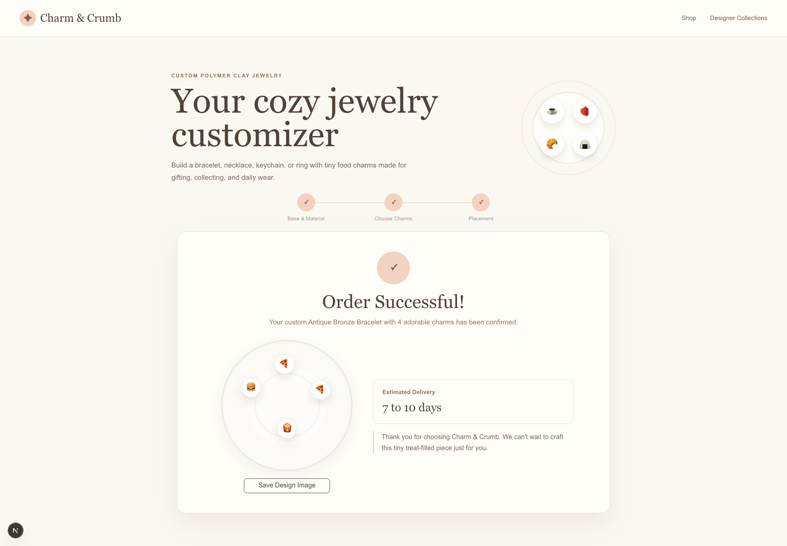

# Charm & Crumb

Charm & Crumb is a cozy frontend customizer for designing personalized clay jewelry. Customers can choose a base, pick a metal finish, add tiny food charms, drag them into place, review the order, and confirm their final design.

The project focuses on making custom ordering feel visual, playful, and clear instead of forcing customers to imagine the finished piece from a plain product list.



## Website Walkthrough

### 1. Choose a Base and Material

Customers start by selecting the jewelry base and finish. The page uses large product previews, swatches, and clear pricing so the first decision feels simple.


### 2. Curate Charms

The charm step turns browsing into a collection-building experience. Each charm card shows the charm mark, name, and price, while the tray keeps the selected charms visible.



### 3. Place the Charms

The placement step lets customers drag charms onto the jewelry preview. This makes the design feel tangible before checkout and gives customers control over the final arrangement.



### 4. Confirm the Order

After placement, the success page confirms the order, shows the final design, provides an estimated delivery window, and lets the customer save the design as an image.



## Features

- Guided multi-step custom jewelry flow
- Base selection with product preview images
- Material selection with polished swatches
- Expanded food charm collection
- Reusable charm cards with mark, name, and price
- Live charm tray with item counts
- Drag-and-drop charm placement
- Order summary with itemized charm list
- Confirmation page with success message
- Estimated delivery: 7 to 10 days
- Downloadable confirmed design image
- Responsive layout for desktop and mobile

## Tech Stack

- Next.js App Router
- React
- TypeScript
- Tailwind CSS
- shadcn/ui-style components
- Base UI primitives

## Methodology

This project was built with a GSD approach: get the core flow working first, then polish the details users actually touch.

The work moved in practical slices:

1. Build the base and material selection.
2. Add charm browsing and tray management.
3. Implement drag-and-drop placement.
4. Refine the order summary and confirmation page.
5. Verify with lint and production build checks.

## Getting Started

Install dependencies:

```bash
npm install
```

Run the development server:

```bash
npm run dev
```

Open the app:

```text
http://localhost:3000
```

## Verification

Run lint:

```bash
npm run lint
```

Create a production build:

```bash
npm run build
```

## Project Structure

```text
app/
  _components/
    canvas-step.tsx
    charm-card.tsx
    charms-step.tsx
    confirmation-step.tsx
    order-summary.tsx
    placement-step.tsx
screenshots/
  step-1.png
  step-2.png
  step-3.png
  step-4.png
slides/
  pitch.md
report.md
```

## Project Goal

Charm & Crumb shows how a small ecommerce idea can feel more personal through interaction. Instead of asking customers to trust a generic product photo, the site lets them build their own piece and see the design come together step by step.
