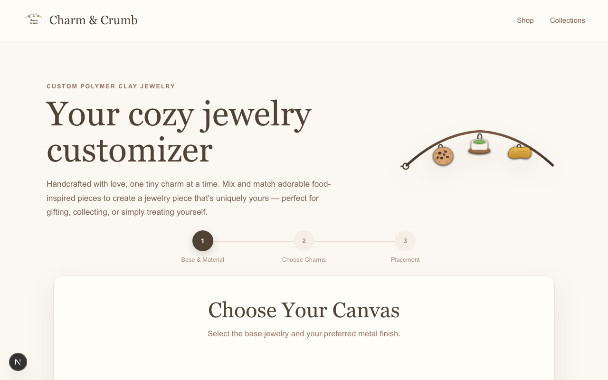
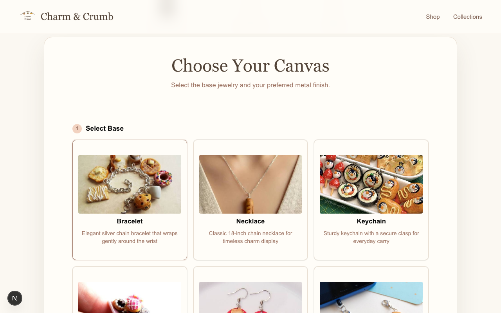
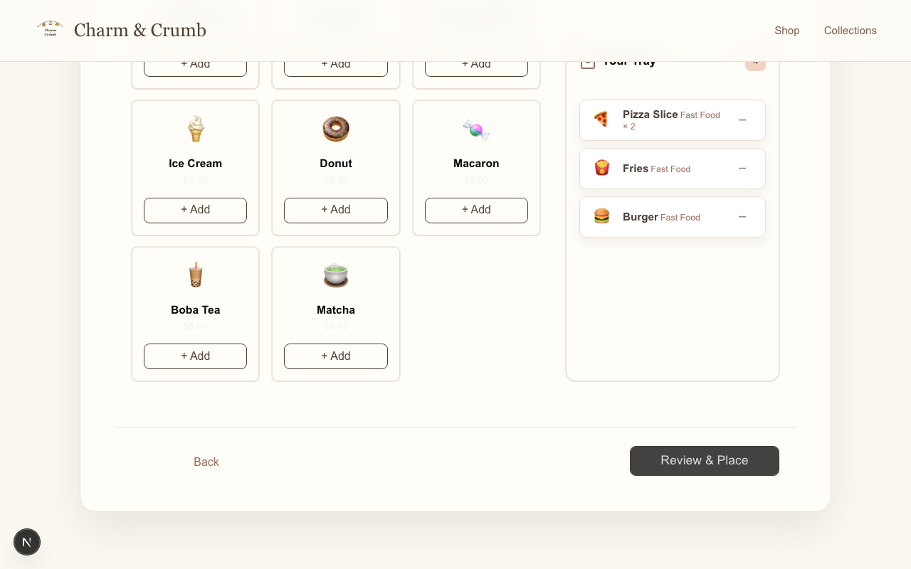
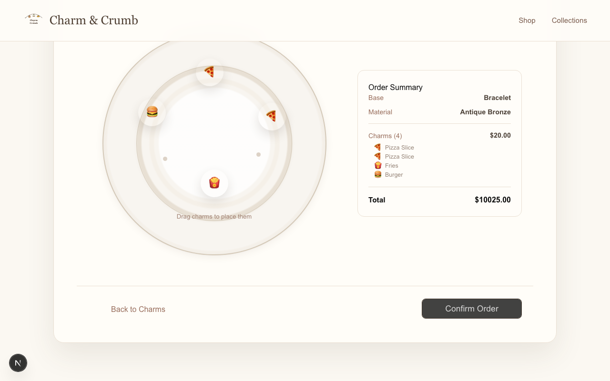
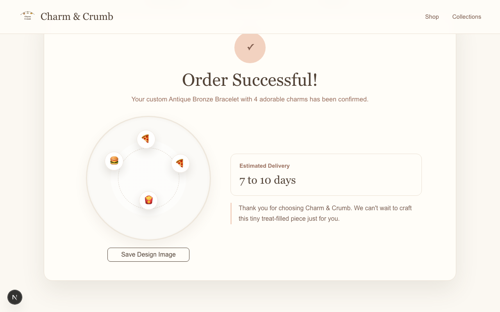

# ch-4 Personal Project — Report

## Project

- **GitHub username:** @MyatSuMon253
- **Repo URL:** https://github.com/MyatSuMon253/charm-and-crumb
- **Live / download URL:** https://charm-and-crumb.vercel.app/
- **License:** Proprietary / All rights reserved
- **One-line summary:** Charm & Crumb is a cozy frontend customizer for designing personalized clay jewelry with selectable bases, finishes, charms, drag-and-drop placement, and order confirmation.

## Product-Intro Slides

- **Slides path:** slides/intro.md

## Demo Screenshots

- **Resolution used:** 1280×800 desktop

## Notes

- Install dependencies with `npm install`.
- Run the app with `npm run dev`.
- Run lint with `npm run lint`.
