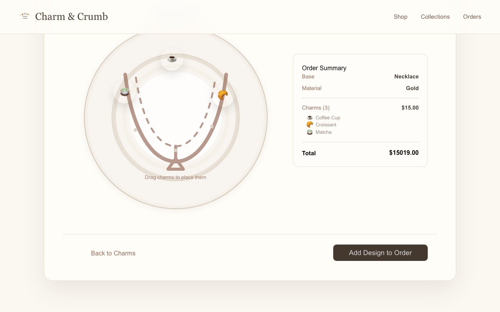
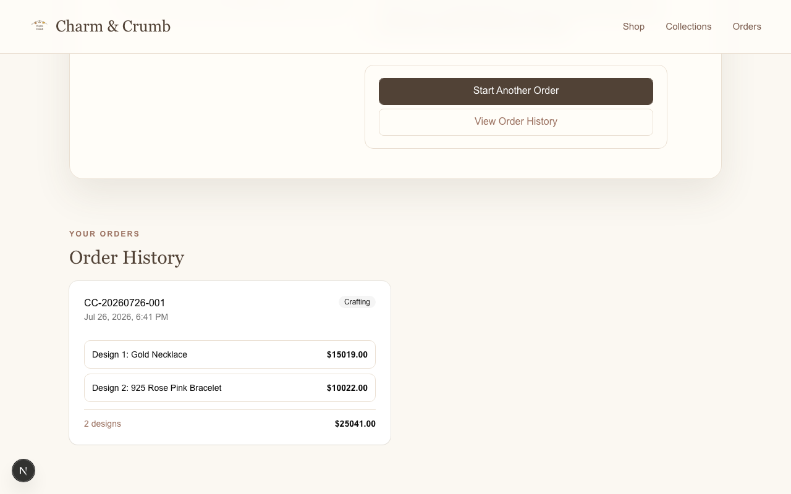
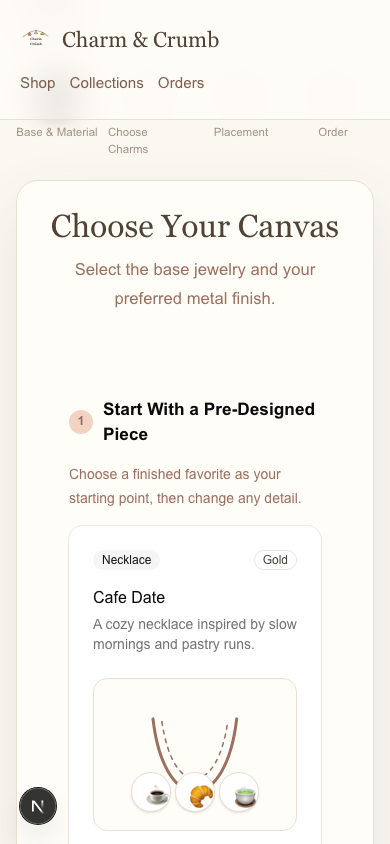

# ch-6 Personal Project — Report

## Project

- **GitHub username:** @MyatSuMon253
- **Repo URL:** https://github.com/MyatSuMon253/charm-and-crumb
- **Live URL (deployed, public):** https://charm-and-crumb.vercel.app/
- **License:** Proprietary / All rights reserved

## Issues Closed (from Chapter 5 feedback)

| # | Issue | Closed link | Fixed with (AI agent / MCP / skill) |
|---|---|---|---|
| 1 | Show the selected jewelry base in the placement preview | [GitHub issue #1](https://github.com/MyatSuMon253/charm-and-crumb/issues/1) | Codex + Next.js/React skill + Playwright |
| 2 | Add a collection of pre-designed jewelry items | [GitHub issue #2](https://github.com/MyatSuMon253/charm-and-crumb/issues/2) | Codex + shadcn skill + Context7 MCP + Playwright |
| 3 | Support multiple-item orders and local order history | [GitHub issue #3](https://github.com/MyatSuMon253/charm-and-crumb/issues/3) | Codex + Next.js/React skill + Playwright |

## Polish

- **UI/UX polish:** Added six base-specific placement silhouettes, three responsive pre-designed starters, a four-step multi-design ordering flow, combined order totals, order references and crafting status, session order history, improved button/link semantics, and responsive 44px actions.
- **Chrome DevTools / Playwright used:** Yes — Playwright verified all six placement previews, pre-designed selection, a two-design order, confirmation/history, and desktop 1280×800 plus mobile 390×844 layouts.
- **README polished:** [README.md](https://github.com/MyatSuMon253/charm-and-crumb/blob/main/README.md)
- **Analytics added:** Vercel Web Analytics with `@vercel/analytics/next` in the root App Router layout.

## Updated Screenshots

- **Resolution used:** 1280×800 desktop and 390×844 mobile

## Gallery Card (this project goes public)

- **Title:** Charm & Crumb
- **One-line description:** A cozy visual customizer for creating, combining, and tracking personalized clay jewelry designs.
- **Slides path:** slides/gallery.md
